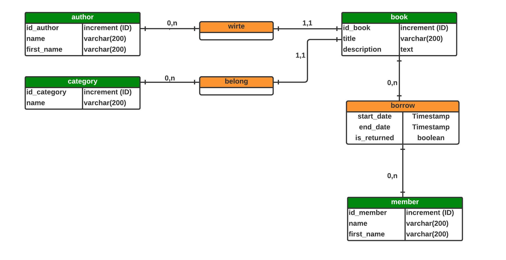

# Prog2 Final

This is just my final project to finish prog2 at HEI

# MCD

# Get started 

- First, you need to use the file [migrations.sql](./src/main/resources/migrations/migrations.sql) to implement the database.
- Next, create an environment variable as shown in the following example :
 
```shell
    DB_PASSWORD="you_password"
    DB_USERNAME="your_postgres_user"
    DB_URL="jdbc:postgresql://localhost:5432/prog2"
```
- Now , you should be able to run the server
